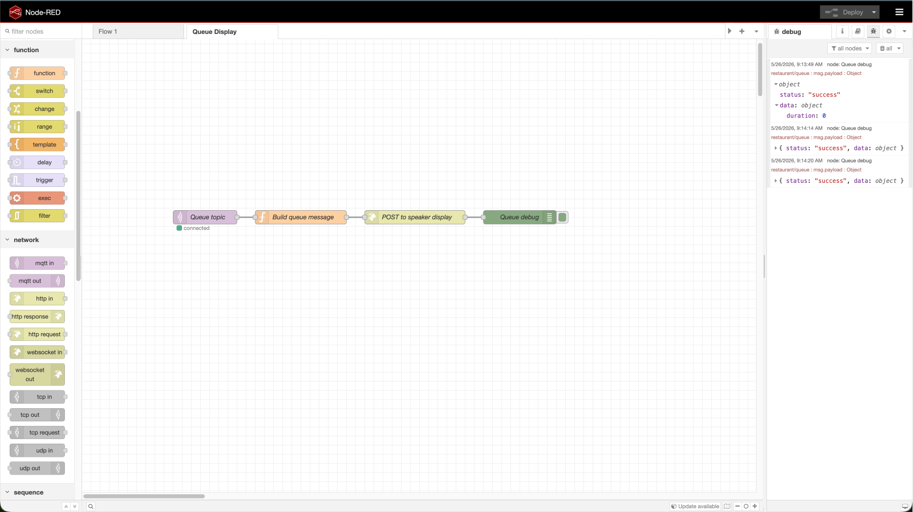
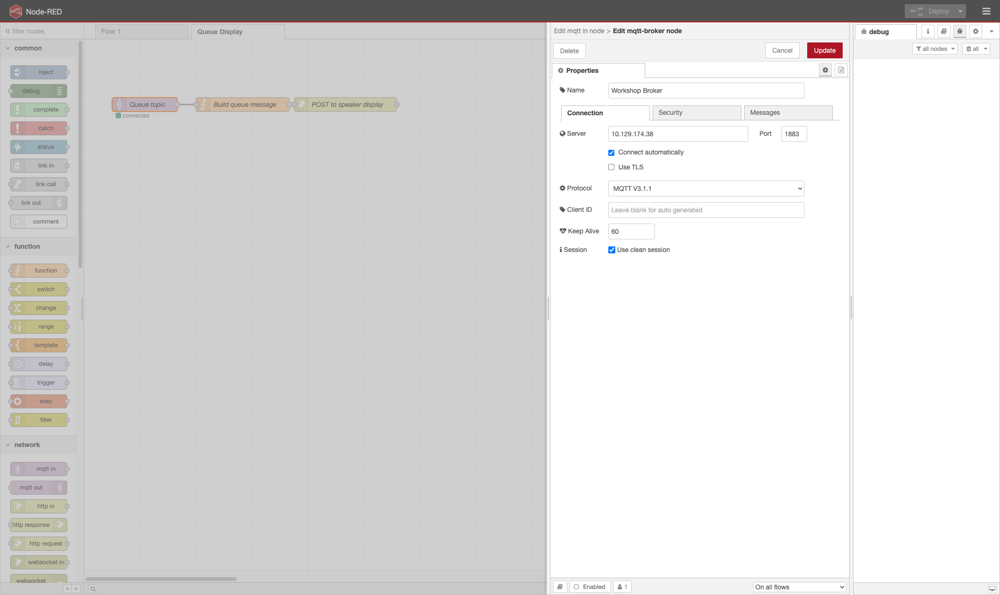
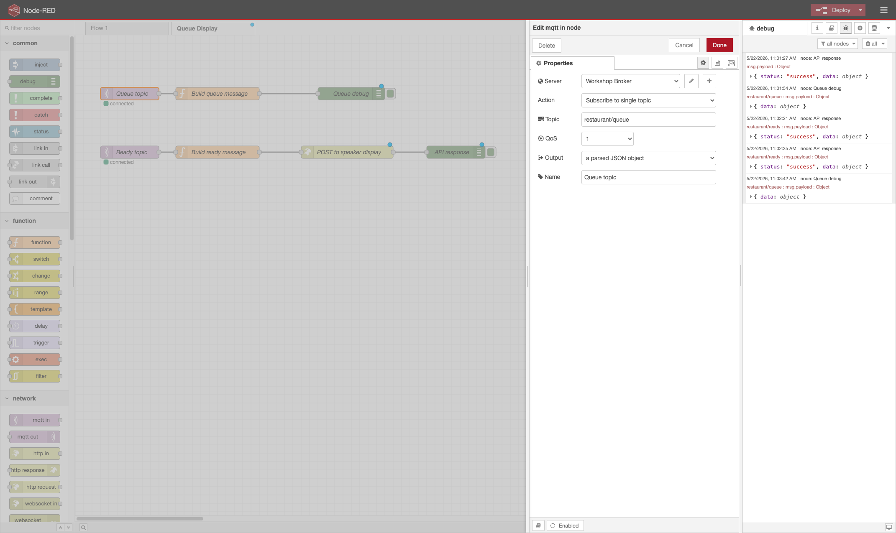
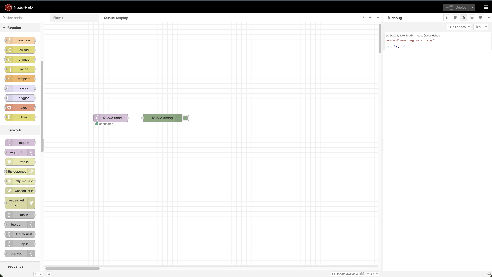
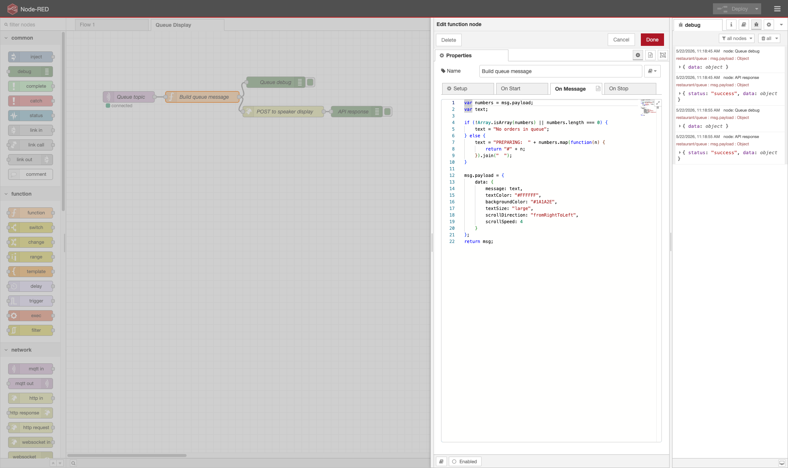
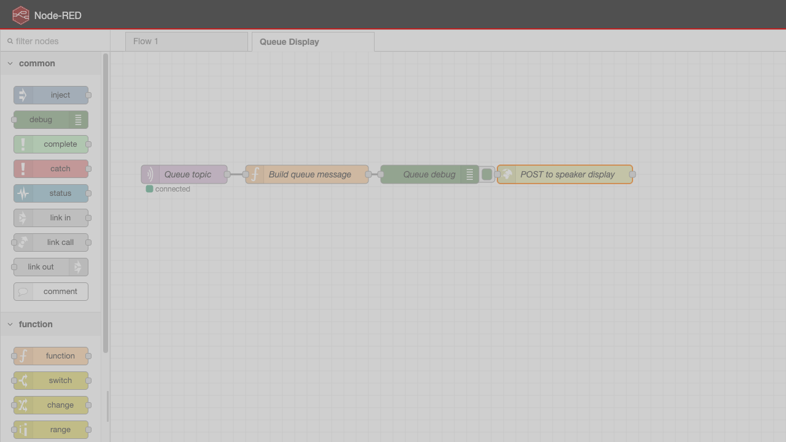
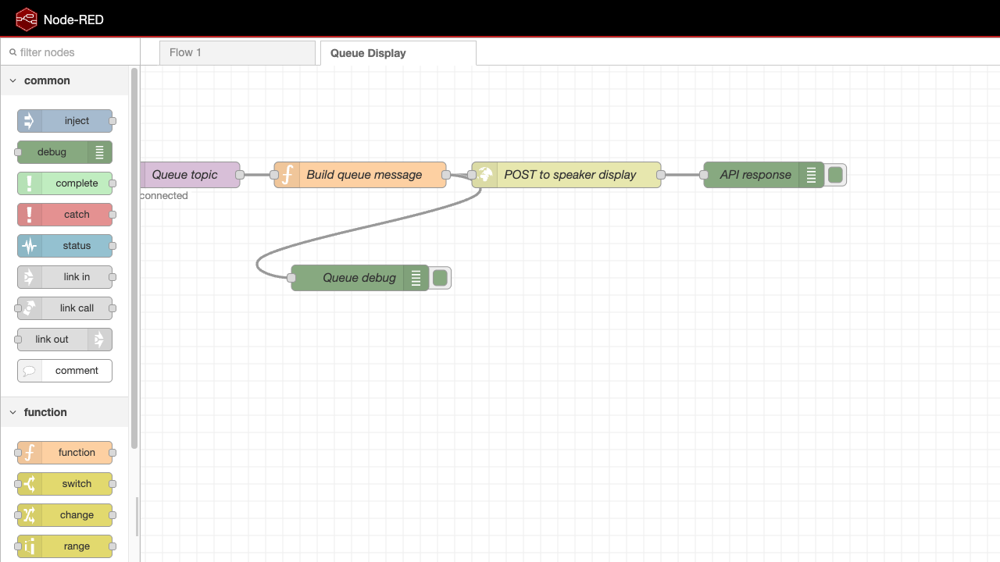
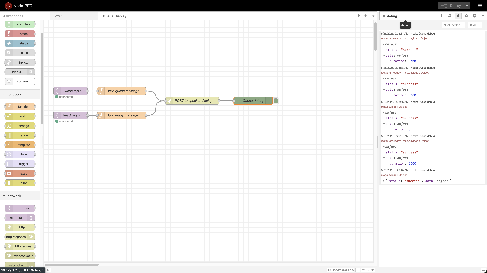
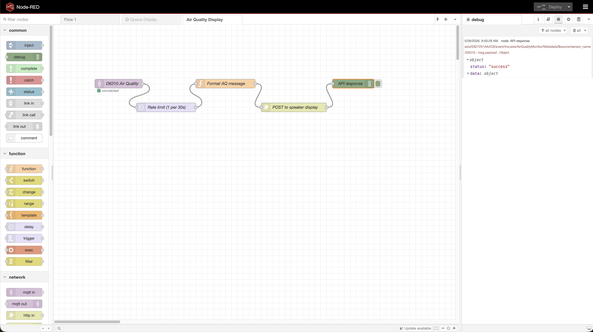

# Axis Display Speaker - Queue Display Workshop

## Introduction

In this hands-on workshop you will build a live information display system using an Axis network speaker with a built-in screen. Starting from a blank Node-RED canvas, you will wire together MQTT subscriptions, data formatting logic, and HTTP API calls to push real-time content to the display. No pre-built flows are provided - you will construct every node and connection yourself.

The scenario is a restaurant order queue: customers place orders, the kitchen prepares them, and the display keeps everyone informed. Along the way you will learn how VAPIX works, how to coordinate multiple data sources with flow context, and how to repurpose the same pattern for sensor data.

---

Build a restaurant-style order queue system from scratch in Node-RED. You will subscribe to live queue state over MQTT and drive an Axis Display Speaker using the VAPIX Speaker Display Notification API.

By the end of this workshop your speaker will display:

```
restaurant/queue  -->  Node-RED  -->  PREPARING:  #3  #7  #12    (white on dark blue, scrolling)
restaurant/ready  -->  Node-RED  -->  ORDER READY:  #2  #5        (black on green, 8 s timer)
                                  -->  reverts to queue view       (after 8 seconds)
```

### Components

| Component | Role |
|---|---|
| MQTT Broker (10.129.174.38:1883) | Publishes live queue and ready order lists as JSON arrays |
| Node-RED (http://localhost:1880) | Subscribes to MQTT, formats messages, calls VAPIX API |
| Axis Display Speaker | Shows queue status on screen |

## Prerequisites

- Axis Display Speaker (factory defaulted, one per participant)
- AXIS IP Utility (already installed)
- Node-RED already running at http://localhost:1880 from Workshop 1

---

## Part 1: Set Up Your Speaker

### Step 1.1 - Find Your Speaker's IP

1. Power on your Axis Display Speaker
2. Open **AXIS IP Utility** on your workstation
3. Wait for the speaker to appear in the device list
4. Note the IP address shown next to your speaker's serial number

### Step 1.2 - Set Credentials

1. Open a browser and navigate to `http://<speaker-ip>`
2. The speaker will prompt you to create a new user on first access
3. Set a **username** and **password** of your choosing
4. Click **Save** / **Create**
5. Write down your credentials - you will use them several times during this workshop

### Step 1.3 - Verify the Display API

VAPIX is Axis's REST API framework for controlling device features over HTTP. Instead of pressing buttons in a web UI, you send HTTP requests to endpoints on the device. In this workshop you will POST JSON to the speaker's display notification endpoint to control what text appears on screen.

Before building anything in Node-RED, confirm the VAPIX Display API is reachable:

1. Open a new browser tab
2. Navigate to: `http://<speaker-ip>/config/rest/speaker-display-notification/v1/simple`
3. Enter your credentials when prompted
4. You should get a JSON response (even if it is an error about method not allowed) - this confirms the endpoint is accessible

> If you get a connection timeout, double-check the IP address. If you get a 404, your speaker firmware may need updating - ask the workshop host.

---

## Part 2: Build the Queue Display Flow

You will build the entire flow by hand, node by node. This teaches you how Node-RED works and how the VAPIX API expects data.

**What you are about to build:**

| Node | Type | Role |
|---|---|---|
| Queue topic | mqtt in | Subscribes to the broker and receives the live order list |
| Build queue message | function | Transforms the raw array into the JSON payload the VAPIX API expects |
| POST to speaker display | http request | Sends the payload to your speaker over HTTP |
| Debug nodes | debug | Let you see what is flowing through the pipeline at each stage |

The data flows left to right: broker publishes an array like `[3, 7, 12]`, your function formats it into display text, and the HTTP node delivers it to the speaker.



### Step 2.1 - Create a New Flow Tab

1. Open Node-RED: http://localhost:1880
2. Click the **+** tab button at the top of the workspace to create a new flow
3. Double-click the new tab header and name it `Queue Display`
4. Click **Done**

### Step 2.2 - Add the MQTT Broker Configuration

Before adding MQTT nodes, you need to configure the broker connection that your nodes will share.

1. From the left palette, drag an **mqtt in** node onto the canvas
2. Double-click the node to open its settings
3. Click the pencil icon (✎) next to the **Server** dropdown to add a new broker
4. In the **Connection** tab:
   - **Name**: `Workshop Broker`
   - **Server**: `10.129.174.38`
   - **Port**: `1883`
5. Leave all other settings at defaults (no TLS, no authentication)
6. Click **Add**



7. You are now back in the MQTT node settings - do not close it yet (continue to the next step)

### Step 2.3 - Configure the Queue Topic Subscription

Continuing from the MQTT node you just opened:

1. Set **Name** to `Queue topic`
2. Set **Topic** to `restaurant/queue`
3. Set **QoS** to `1`
4. Set **Output** to `a parsed JSON object`


5. Click **Done**

The node should appear on your canvas with the label "Queue topic".

### Step 2.4 - Add a Debug Node to Verify Messages

Before building the full pipeline, let's confirm MQTT messages are arriving.

1. Drag a **debug** node from the palette onto the canvas, to the right of your MQTT node
2. Double-click it and set **Name** to `Queue debug`
3. Leave **Output** set to `msg.payload`
4. Click **Done**
5. Draw a wire: click the grey dot on the right side of **Queue topic** and drag to the grey dot on the left side of **Queue debug**
6. Click **Deploy** (top right)
7. Open the **Debug** panel (bug icon in the right sidebar)
8. You should see JSON arrays arriving every few seconds, e.g. `[3, 7, 12]`

> If nothing appears after 10 seconds, check that the MQTT node shows a green "connected" status below it. If it shows "disconnected", double-click the node and verify the broker settings.



### Step 2.5 - Add the Function Node (Build Queue Message)

Now you will write the logic that transforms the raw queue array into a display API payload.

1. Drag a **function** node onto the canvas, between the MQTT node and the debug node
2. Double-click it and set **Name** to `Build queue message`
3. In the **Function** tab (the code editor), paste the following code:

```javascript
var numbers = msg.payload;
var text;

if (!Array.isArray(numbers) || numbers.length === 0) {
    text = 'No orders in queue';
} else {
    text = 'PREPARING:  ' + numbers.map(function(n) {
        return '#' + n;
    }).join('  ');
}

msg.payload = {
    data: {
        message: text,
        textColor: '#FFFFFF',
        backgroundColor: '#1A1A2E',
        textSize: 'large',
        scrollDirection: 'fromRightToLeft',
        scrollSpeed: 4
    }
};
return msg;
```

4. Click **Done**

**Understanding the code:**
- `msg.payload` arrives as a JSON array like `[3, 7, 12]` from the MQTT node
- We format it into a string like `PREPARING:  #3  #7  #12`
- We build the payload object that the VAPIX API expects: message text, colors, size, scroll settings



### Step 2.6 - Add the HTTP Request Node (POST to Speaker)

This node sends the formatted payload to your speaker.

1. Drag an **http request** node onto the canvas, to the right of the function node
2. Double-click it and configure:
   - **Name**: `POST to speaker display`
   - **Method**: `POST`
   - **URL**: `http://<your-speaker-ip>/config/rest/speaker-display-notification/v1/simple`  
     (replace `<your-speaker-ip>` with your actual IP)
   - **Payload**: select `Ignore`
   - **Authentication**: select `digest authentication`  
     (Axis devices use Digest auth rather than Basic auth. Digest never sends your password in cleartext - it uses a challenge-response handshake instead.)
   - **Username**: your speaker username
   - **Password**: your speaker password
   - **Return**: select `a parsed JSON object`
3. Click **Done**



### Step 2.7 - Add a Response Debug Node

1. Drag another **debug** node to the right of the HTTP request node
2. Name it `API response`
3. Click **Done**

### Step 2.8 - Wire the Nodes Together

Delete the old wire from the MQTT node to the debug node (click the wire, press Delete).

Now rewire your nodes in sequence, reusing the **Queue debug** node between the function and the HTTP request so you can see the formatted payload:

```
[Queue topic] --> [Build queue message] --> [Queue debug] --> [POST to speaker display] --> [API response]
```

Click from the output (right dot) of each node to the input (left dot) of the next. You now have two debug nodes: one showing what you send, one showing the speaker's response.

### Step 2.9 - Deploy and Test the Queue Display

1. Click **Deploy**
2. Watch the **Debug** panel - you should see:
   - The formatted payload object in **Queue debug** (the `data.message` field should read something like `PREPARING:  #3  #7  #12`)
   - The API response in **API response** (should be a `200` status with a success body)
3. Look at your speaker - it should be scrolling something like `PREPARING:  #3  #7  #12`



**Checkpoint:** Your speaker is now showing the live queue. If the API response shows an error, check:
- `401` = wrong credentials
- `404` = wrong URL path
- Connection error = wrong speaker IP

---

## Part 3: Customize the Display

Now that you have a working queue display, take a moment to experiment with its appearance. This part is quick and rewarding - you will see changes on the speaker in real time.

### Step 3.1 - Change Colors

1. Double-click **Build queue message**
2. Edit the `backgroundColor` and `textColor` fields. Values are RGB hex strings:
   - Dark blue (current): `#1A1A2E`
   - Try navy: `#003366`, purple: `#4B0082`, dark green: `#1B4332`
3. Click **Done** then **Deploy**

### Step 3.2 - Change Scroll Behavior

In the function node, modify these fields:

| Field | Options |
|---|---|
| `scrollSpeed` | `0` (static) through `10` (fastest) |
| `scrollDirection` | `fromRightToLeft`, `fromLeftToRight`, `fromBottomToTop` |
| `textSize` | `small`, `medium`, `large` |

Try setting `scrollSpeed` to `0` to get a static display (useful if the text is short enough to fit on screen).

### Step 3.3 - Change the Message Format

Edit the `text` variable in the function node:
- Change `'PREPARING:  '` to `'NOW COOKING:  '` or `'IN PROGRESS:  '`

### Step 3.4 - Add a Static Prefix

Try displaying a restaurant name before the queue. Change the text line to:

```javascript
text = 'CAFE AXIS  |  PREPARING:  ' + numbers.map(function(n) {
    return '#' + n;
}).join('  ');
```

**Checkpoint:** Your display looks the way you want it. When you are done experimenting, revert to the original colors (white on dark blue) and text format before moving on, or keep your customizations - it is up to you.

---

## Part 4: Add the "Order Ready" Alert

The ready alert temporarily overrides the queue display with a green "ORDER READY" message, then reverts back after 8 seconds.

### Step 4.1 - Add a Second MQTT Subscription

1. Drag another **mqtt in** node onto the canvas, below the queue row
2. Double-click it and configure:
   - **Name**: `Ready topic`
   - **Server**: select the `Workshop Broker` you already created (it will appear in the dropdown)
   - **Topic**: `restaurant/ready`
   - **QoS**: `1`
   - **Output**: `a parsed JSON object`
3. Click **Done**

### Step 4.2 - Add the Ready Message Function Node

1. Drag a **function** node onto the canvas, to the right of the Ready topic node
2. Wire: drag from the output of **Ready topic** to the input of this new function node
3. Double-click the function node, set **Name** to `Build ready message`
4. Paste this code:

```javascript
var numbers = msg.payload;

if (!Array.isArray(numbers) || numbers.length === 0) {
    // Ready list was cleared - revert to queue view immediately
    var t = flow.get('revertTimer');
    if (t) { clearTimeout(t); flow.set('revertTimer', null); }
    flow.set('showingReady', false);

    var queueText = flow.get('queueText') || 'No orders in queue';
    msg.payload = {
        data: {
            message: queueText,
            textColor: '#FFFFFF',
            backgroundColor: '#1A1A2E',
            textSize: 'large',
            scrollDirection: 'fromRightToLeft',
            scrollSpeed: 4
        }
    };
    return msg;
}

// Build the ready alert text
var text = 'ORDER READY:  ' + numbers.map(function(n) {
    return '#' + n;
}).join('  ');

flow.set('showingReady', true);

// Cancel any existing revert timer
var existing = flow.get('revertTimer');
if (existing) clearTimeout(existing);

// Schedule revert back to queue view after 8 seconds.
// node.send() lets a function node emit a message asynchronously (outside
// the normal return flow). Here it fires 8 seconds later from inside the
// timer callback, sending the queue text back to the display.
var timer = setTimeout(function() {
    flow.set('showingReady', false);
    flow.set('revertTimer', null);
    var queueText = flow.get('queueText') || 'No orders in queue';
    node.send({
        payload: {
            data: {
                message: queueText,
                textColor: '#FFFFFF',
                backgroundColor: '#1A1A2E',
                textSize: 'large',
                scrollDirection: 'fromRightToLeft',
                scrollSpeed: 4
            }
        }
    });
}, 8000);
flow.set('revertTimer', timer);

// Send the green ready alert now
msg.payload = {
    data: {
        message: text,
        textColor: '#000000',
        backgroundColor: '#00CC44',
        textSize: 'large',
        scrollDirection: 'fromRightToLeft',
        scrollSpeed: 5,
        duration: { type: 'time', value: 8000 }
    }
};
return msg;
```

5. Click **Done**

**Understanding the code:**
- When orders are ready, we show a green banner with the order numbers
- We set a timer that fires after 8 seconds to revert back to the queue view
- `flow.set('showingReady', true)` is a flag so the queue node knows not to overwrite the ready alert
- `node.send()` inside the timer lets the function node send a message asynchronously after the delay

### Step 4.3 - Update the Queue Function to Respect the Ready Flag

Now you need to modify **Build queue message** so it coordinates with the ready alert. Two changes are needed:

1. Save the queue text into shared flow context so the ready node can retrieve it when reverting
2. Skip sending to the display if a ready alert is currently showing

Open **Build queue message** and replace the code with this updated version:

1. Double-click **Build queue message**
2. Replace the entire code with:

```javascript
var numbers = msg.payload;
var text;

if (!Array.isArray(numbers) || numbers.length === 0) {
    text = 'No orders in queue';
} else {
    text = 'PREPARING:  ' + numbers.map(function(n) {
        return '#' + n;
    }).join('  ');
}

// Save the current queue text into flow context.
// flow.set() stores a value that any function node on this tab can
// read with flow.get(). The ready node uses this to revert the display.
flow.set('queueText', text);

// Only send to display if we are not currently showing a ready alert
if (!flow.get('showingReady')) {
    msg.payload = {
        data: {
            message: text,
            textColor: '#FFFFFF',
            backgroundColor: '#1A1A2E',
            textSize: 'large',
            scrollDirection: 'fromRightToLeft',
            scrollSpeed: 4
        }
    };
    return msg;
}
return null;
```

3. Click **Done**

**What changed:**
- `flow.set('queueText', text)` - stores the latest queue text in flow-level shared context. Think of this as a variable that lives on the tab, accessible by any function node via `flow.get('queueText')`.
- `if (!flow.get('showingReady'))` - checks whether the ready alert is active. If it is, we still save the queue text (so it is available for revert) but return `null`, which tells Node-RED not to pass the message onward.

### Step 4.4 - Wire the Ready Output to the Speaker

Now connect **Build ready message** to the existing **POST to speaker display** node:

1. Drag a wire from the output of **Build ready message** to the input of **POST to speaker display**

Your ready row should now look like:

```
[Ready topic] --> [Build ready message] --> [POST to speaker display]
```

Multiple nodes can feed into one node - both the queue function and the ready function now share the same HTTP request node.

### Step 4.5 - Deploy and Test

1. Click **Deploy**
2. Watch the debug panel. You should see:
   - Queue messages continuing to flow
   - Occasional ready messages (the simulator fires them every 20-30 seconds)
3. When a ready message arrives:
   - The display turns **green** with `ORDER READY: #N`
   - After 8 seconds it reverts to the blue queue scroll



**Checkpoint:** Both the queue display and the ready alert are working. The display alternates between the two states automatically.

### Step 4.6 - Customize the Alert (Optional)

Now that the ready alert works, you can tweak it:

- **Change colors:** Edit `backgroundColor: '#00CC44'` in Build ready message (try `#FFD700` for gold, `#FF6347` for red)
- **Change duration:** Find `}, 8000);` in the setTimeout call and change `8000` to your preferred milliseconds (5000 = 5s, 15000 = 15s). Also update `duration: { type: 'time', value: 8000 }` to match.
- **Change text:** Change `'ORDER READY:  '` to `'PICK UP:  '`

---

## Part 5: Voice Announcement (Bonus)

> This part is optional. It adds audio announcements for ready orders using text-to-speech. If you are short on time, skip to Part 6.

The visual alert is great, but what if staff aren't watching the screen? In this part you will add an audio announcement that reads the order number aloud through the speaker. The approach uses a free Google Translate TTS endpoint to generate speech, uploads the audio clip to the speaker, then plays it.

### How It Works

```
restaurant/ready  -->  Build TTS URL  -->  Google TTS  -->  Upload MP3  -->  Play Clip
                       (function)          (HTTP GET)       (HTTP POST)      (HTTP GET)
```

The speaker can store and play audio clips via its `mediaclip.cgi` API. We fetch a speech MP3 from Google Translate, upload it to the device, then trigger playback. The function tracks which orders have already been announced so you only hear new ones.

### Step 5.1 - Add MQTT Input

1. Drag an **mqtt in** node onto the canvas (you can create this on the same flow tab or a new one)
2. Double-click and configure:
   - **Topic:** `restaurant/ready`
   - **Broker:** select your existing broker (10.129.174.38:1883)
   - **Output:** String
3. Click **Done**

### Step 5.2 - Build TTS URL

1. Drag a **function** node onto the canvas and connect it to the mqtt-in output
2. Name it `Build TTS URL`
3. Paste this code:

```javascript
// Parse JSON array of ready order numbers
var readyOrders;
try {
    readyOrders = JSON.parse(msg.payload);
} catch(e) {
    readyOrders = [msg.payload];
}

// Skip empty arrays
if (!Array.isArray(readyOrders) || readyOrders.length === 0) {
    return null;
}

// Get previously announced orders from flow context
var announced = flow.get('announcedOrders') || [];

// Find only NEW orders (not yet announced)
var newOrders = readyOrders.filter(function(order) {
    return announced.indexOf(order) === -1;
});

// If no new orders, stop
if (newOrders.length === 0) {
    return null;
}

// Save current ready list as announced
flow.set('announcedOrders', readyOrders);

// Build announcement text
var text;
if (newOrders.length === 1) {
    text = 'Order number ' + newOrders[0] + ' is ready for pickup';
} else {
    var last = newOrders.pop();
    text = 'Orders ' + newOrders.join(', ') + ' and ' + last + ' are ready for pickup';
}

var encoded = encodeURIComponent(text);
msg.url = 'https://translate.google.com/translate_tts?ie=UTF-8&client=tw-ob&tl=en&q=' + encoded;

return msg;
```

4. Click **Done**

This function does three things:
- Parses the JSON array of order numbers
- Compares against previously announced orders (stored in flow context) to find only new ones
- Builds a natural language sentence and constructs the Google TTS URL

### Step 5.3 - Fetch the Audio

1. Drag an **http request** node and connect it after the function
2. Double-click and configure:
   - **Method:** GET
   - **URL:** leave blank (set by `msg.url`)
   - **Return:** a binary buffer
3. Click **Done**

This node calls Google Translate TTS and returns raw MP3 audio in `msg.payload`.

### Step 5.4 - Build the Upload Request

1. Drag another **function** node and connect it after the HTTP request
2. Name it `Build Upload`
3. Paste this code:

```javascript
var boundary = "----NodeREDFormBoundary";
var filename = "tts_announcement.mp3";

// Wrap MP3 binary in a multipart form body
var header = Buffer.from(
    "--" + boundary + "\r\n" +
    "Content-Disposition: form-data; name=\"file\"; filename=\"" + filename + "\"\r\n" +
    "Content-Type: audio/mpeg\r\n\r\n"
);
var footer = Buffer.from("\r\n--" + boundary + "--\r\n");

msg.payload = Buffer.concat([header, msg.payload, footer]);
msg.headers = {
    "Content-Type": "multipart/form-data; boundary=" + boundary
};

// Clear stale url from previous node
delete msg.url;

return msg;
```

4. Click **Done**

### Step 5.5 - Upload to Speaker

1. Drag an **http request** node and connect it after Build Upload
2. Configure:
   - **Method:** POST
   - **URL:** `http://<speaker-ip>/axis-cgi/mediaclip.cgi?action=upload`
   - **Return:** a UTF-8 string
   - **Authentication:** Digest
   - **Username / Password:** your speaker credentials
3. Replace `<speaker-ip>` with your speaker's IP address
4. Click **Done**

### Step 5.6 - Parse Clip ID and Play

1. Drag a **function** node and connect it after the upload HTTP node
2. Name it `Parse Clip ID & Play`
3. Paste this code:

```javascript
// Response is "OK\nUploaded=3" or "OK\nReplaced=3"
var response = msg.payload;
var match = response.match(/(?:Uploaded|Replaced)=(\d+)/);

if (match) {
    var clipId = match[1];
    msg.url = "http://<speaker-ip>/axis-cgi/mediaclip.cgi?action=play&clip=" + clipId;
    msg.payload = null;
    // Clear stale headers from upload step
    delete msg.headers;
    return msg;
}

node.error("Failed to parse clip ID from: " + response);
return null;
```

4. Replace `<speaker-ip>` with your speaker's IP address
5. Click **Done**

### Step 5.7 - Play the Clip

1. Drag a final **http request** node and connect it after the function
2. Configure:
   - **Method:** GET
   - **URL:** leave blank
   - **Return:** a UTF-8 string
   - **Authentication:** Digest
   - **Username / Password:** your speaker credentials
3. Click **Done**
4. Optionally add a **debug** node at the end to see the play response

### Step 5.8 - Deploy and Test

1. Click **Deploy**
2. The MQTT broker is already publishing ready orders from the simulator
3. When the next ready order arrives, you should hear the speaker say the order number aloud
4. Test manually by publishing: open a terminal and run:

```bash
mosquitto_pub -h 10.129.174.38 -p 1883 -t "restaurant/ready" -m "[99]"
```

5. Publish the same message again - it should stay **silent** (order 99 was already announced)
6. Add a new order to the list - only the new one is spoken:

```bash
mosquitto_pub -h 10.129.174.38 -p 1883 -t "restaurant/ready" -m "[99, 100]"
```

**Checkpoint:** The speaker both displays AND announces ready orders. Only new orders trigger a voice announcement - repeated messages are suppressed.

> **Note:** Google Translate TTS is a free unofficial endpoint. It works well for short phrases but may rate-limit under heavy use. For production deployments, consider a dedicated TTS service.

---

## Part 6: Display Air Quality Data on the Speaker

Combine both workshops. Pull live air quality data from the D6310 sensors (already flowing through the MQTT broker from Workshop 1) and show it on your speaker.

> Before starting: right-click the **Queue Display** tab and select **Disable**, then click **Deploy**. This prevents the queue flow from overwriting the air quality display while you work on it. You can re-enable it later.

### Step 6.1 - Create a New Flow Tab

1. Click the **+** button to create another new flow tab
2. Name it `Air Quality Display`
3. Click **Done**

### Step 6.2 - Add the MQTT Subscription

1. Drag an **mqtt in** node onto the canvas
2. Double-click and configure:
   - **Name**: `D6310 Air Quality`
   - **Server**: select the existing `Workshop Broker` from the dropdown
   - **Topic**: `axis/+/event/tns:axis/AirQualityMonitor/Metadata/#`
   - **QoS**: `0`
   - **Output**: `auto-detect`
3. Click **Done**

**Understanding the topic:**
- `axis/` - all Axis device messages start with this prefix
- `+` - single-level wildcard, matches any sensor serial number
- `event/tns:axis/AirQualityMonitor/Metadata/#` - the air quality event path
- `#` - multi-level wildcard for sub-topics

This subscribes to all four D6310 sensors. To show only one sensor, replace `+` with its serial:

| Location | Serial |
|---|---|
| Play Space | E827251A7B8B |
| Learn Space | E827251A7B09 |
| Server Rack | E827251AA4C6 |
| Entrance | E827251A8AF7 |

### Step 6.3 - Add a Rate Limiter

The D6310 sensors publish every second. The speaker display does not need updates that fast - it would cause visual flickering and unnecessary API calls.

1. Drag a **delay** node onto the canvas, to the right of the MQTT node
2. Wire: drag from the output of **D6310 Air Quality** to the input of this delay node
3. Double-click and configure:
   - **Name**: `Rate limit (1 per 30s)`
   - **Action**: select `Rate Limit`
   - **Rate**: `1` msg(s) per `30` `Seconds`
   - Check **drop intermediate messages**
4. Click **Done**

### Step 6.4 - Add the Format Function

1. Drag a **function** node onto the canvas, to the right of the rate limiter
2. Wire: drag from the output of **Rate limit (1 per 30s)** to the input of this function node
3. Double-click it and set **Name** to `Format AQ message`
4. Paste this code:

```javascript
var raw = msg.payload;
var data = raw.data || (raw.message && raw.message.data) || raw;

var aqi  = Number(data['AQI']         || 0).toFixed(0);
var co2  = Number(data['CO2']         || 0).toFixed(0);
var temp = Number(data['Temperature'] || 0).toFixed(1);

var text = 'AQI: ' + aqi + '   CO2: ' + co2 + ' ppm   Temp: ' + temp + '°C';

msg.payload = {
    data: {
        message: text,
        textColor: '#FFFFFF',
        backgroundColor: '#2D1B69',
        textSize: 'large',
        scrollDirection: 'fromRightToLeft',
        scrollSpeed: 4
    }
};
return msg;
```

5. Click **Done**

**Understanding the code:**
- The D6310 sends data in a nested structure - we try multiple possible paths to find it
- We extract `AQI`, `CO2`, and `Temperature` from the payload
- We format everything into a single scrolling display string

### Step 6.5 - Add the HTTP Request Node

1. Drag an **http request** node onto the canvas, to the right of the function node
2. Wire: drag from the output of **Format AQ message** to the input of this HTTP node
3. Configure it identically to the one you built in Part 2:
   - **Name**: `POST to speaker display`
   - **Method**: `POST`
   - **URL**: `http://<your-speaker-ip>/config/rest/speaker-display-notification/v1/simple`
   - **Payload**: `Ignore`
   - **Authentication**: `digest authentication`
   - **Username** / **Password**: your speaker credentials
   - **Return**: `a parsed JSON object`
3. Click **Done**

### Step 6.6 - Add a Debug Node

1. Drag a **debug** node to the right of the HTTP request node
2. Wire: drag from the output of **POST to speaker display** to the input of the debug node
3. Double-click it and set **Name** to `API response`
4. Click **Done**

Your completed flow should look like:

```
[D6310 Air Quality] --> [Rate limit (1 per 30s)] --> [Format AQ message] --> [POST to speaker display] --> [API response]
```

### Step 6.7 - Deploy and Test

1. Click **Deploy**
2. Wait up to 30 seconds (the rate limiter will drop messages until the first one passes through)
3. In the debug panel you should see the API response from the speaker
4. Your speaker should display something like:  
   `AQI: 12   CO2: 487 ppm   Temp: 21.4°C`



> **Note:** If you re-enabled the Queue Display tab, both flows will compete for the speaker. Whichever message arrives last "wins." To test one flow at a time, right-click the other tab and select **Disable**, then **Deploy**.

### Step 6.8 - Customize the Air Quality Display

Try these modifications:

**Show additional fields** - the D6310 also publishes `VOC`, `Humidity`, `PM25`. Add them to the text string:

```javascript
var humidity = Number(data['Humidity'] || 0).toFixed(0);
var text = 'AQI: ' + aqi + '  CO2: ' + co2 + ' ppm  Temp: ' + temp + '°C  Humidity: ' + humidity + '%';
```

**Change the update frequency** - double-click the rate limit node and change `30` seconds to `10` seconds for more frequent updates (or `60` for less).

**Change colors** - the current deep purple (`#2D1B69`) makes it visually distinct from the queue display. Try other colors to match the reading severity (e.g. green for good AQI, orange for moderate).

**Add the sensor identifier** - if you want to show which room the reading is from, extract the serial from the MQTT topic and append it:

```javascript
var sensorSerial = msg.topic.split('/')[1] || 'unknown';
var text = 'AQI: ' + aqi + '  CO2: ' + co2 + ' ppm  Temp: ' + temp + '°C  [' + sensorSerial + ']';
```

---

## Part 7: Challenge - Conditional Formatting (Bonus)

> For those who finish early: make the air quality display change color based on the AQI value.

### Goal

| AQI Range | Background Color | Meaning |
|---|---|---|
| 0-50 | `#006400` (green) | Good |
| 51-100 | `#FF8C00` (orange) | Moderate |
| 101+ | `#8B0000` (dark red) | Unhealthy |

### Hints

1. Open **Format AQ message**
2. After computing `aqi`, add conditional logic:

```javascript
var bgColor;
if (aqi <= 50) {
    bgColor = '#006400';
} else if (aqi <= 100) {
    bgColor = '#FF8C00';
} else {
    bgColor = '#8B0000';
}
```

3. Replace the hardcoded `backgroundColor` with the variable: `backgroundColor: bgColor`
4. Deploy and test - the display color should change based on air quality

---

## Reference: Flow JSON Files

If you get stuck or want to verify your work, pre-built flow files are included in this repository:

- `queue_display_flow.json` - the complete queue display from Parts 2-4
- `tts_announcement_flow.json` - the voice announcement flow from Part 5
- `aq_display_flow.json` - the complete air quality display from Part 6

To import: Node-RED menu (☰) > **Import** > **Upload** > select the file > **Import**

You will still need to configure the broker address and speaker credentials after importing.

---

## Troubleshooting

| Symptom | Check |
|---|---|
| MQTT nodes show "disconnected" | Verify broker address is `10.129.174.38`, port `1883`, no TLS |
| No messages in debug panel | Confirm the simulator is running - ask your workshop host |
| Speaker shows nothing | Verify the speaker IP in the URL of the POST node |
| API response shows 401 | Wrong username or password in the POST node credentials |
| API response shows 404 | Wrong URL path - confirm it ends in `/v1/simple` |
| Display not updating on Part 6 | Wait up to 30 s for the rate limiter to pass a message through |
| TTS not playing | Check debug output - verify Google TTS returns binary data, not an error page |
| Upload returns "Unsupported Media Type" | Ensure the audio is actual MP3 (not AAC or empty) |
| Digest auth error | Axis speakers require HTTP Digest - confirm the POST node auth type is set to **Digest** |
| Function node shows error | Open the function node and check the code - look for typos or missing semicolons |
| Wire won't connect | Make sure you are dragging from an output (right side) to an input (left side) |
| Multiple ready alerts stacking | The `clearTimeout` logic should prevent this - check that `flow.set('revertTimer', timer)` is saving the timer reference |

---

## API Reference

The VAPIX Speaker Display Notification API accepts POST requests with this structure:

```json
{
    "data": {
        "message": "Text to display",
        "textColor": "#FFFFFF",
        "backgroundColor": "#1A1A2E",
        "textSize": "large",
        "scrollDirection": "fromRightToLeft",
        "scrollSpeed": 4
    }
}
```

| Field | Type | Options |
|---|---|---|
| `message` | string | The text to show on the display |
| `textColor` | string | RGB hex color for the text |
| `backgroundColor` | string | RGB hex color for the background |
| `textSize` | string | `small`, `medium`, `large` |
| `scrollDirection` | string | `fromRightToLeft`, `fromLeftToRight`, `fromBottomToTop` |
| `scrollSpeed` | number | `0` (static) to `10` (fastest) |
| `duration` | object | Optional. `{ "type": "time", "value": 8000 }` to auto-dismiss after N ms |

---

## Reference

### VAPIX Speaker Display Notification API

All display updates call:
```
POST /config/rest/speaker-display-notification/v1/simple
```
Authentication: HTTP Digest

| Field | Description |
|---|---|
| `message` | Text to display (max 1000 characters) |
| `textColor` | RGB hex, e.g. `#FFFFFF` |
| `backgroundColor` | RGB hex, e.g. `#1A1A2E` |
| `textSize` | `small`, `medium`, or `large` |
| `scrollDirection` | `fromRightToLeft`, `fromBottomToTop`, `fromLeftToRight` |
| `scrollSpeed` | `0` (static) to `10` (fastest) |
| `duration.type` | `time` (milliseconds), `repetitions`, or `timeCompleteMessage` |

Full reference: https://developer.axis.com/vapix/device-configuration/speaker-display-notification/

### MQTT Queue Topics

| Topic | Payload | Description |
|---|---|---|
| `restaurant/queue` | `[3, 7, 12]` | JSON array of order numbers being prepared |
| `restaurant/ready` | `[2, 5]` | JSON array of order numbers ready for pickup |

### D6310 Air Quality Topics (Workshop 1)

| Topic | Description |
|---|---|
| `axis/+/event/tns:axis/AirQualityMonitor/Metadata/#` | All sensors (wildcard) |
| `axis/E827251A7B8B/event/tns:axis/AirQualityMonitor/Metadata/#` | Play Space |
| `axis/E827251A7B09/event/tns:axis/AirQualityMonitor/Metadata/#` | Learn Space |
| `axis/E827251AA4C6/event/tns:axis/AirQualityMonitor/Metadata/#` | Server Rack |
| `axis/E827251A8AF7/event/tns:axis/AirQualityMonitor/Metadata/#` | Entrance |

## What You've Built

- **Part 2:** A live queue display that reacts instantly to order state changes over MQTT
- **Part 3:** A customized display tuned to your visual preferences
- **Part 4:** A coordinated alert system using flow context and timers
- **Part 5:** A voice announcement system using cloud TTS and the speaker's audio playback API
- **Part 6:** A unified IoT data pipeline bridging two Axis sensor systems through a single MQTT broker onto one display

---

Developed for the Axis TTC Workshop
